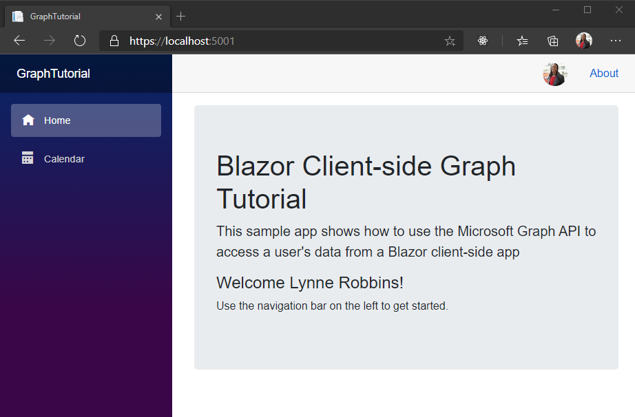

<!-- markdownlint-disable MD002 MD041 -->

この演習では、Azure AD での認証をサポートするために、前の手順で作成したアプリケーションを拡張します。 これは、Microsoft Graph API を呼び出すのに必要な OAuth アクセス トークンを取得するために必要です。

1. **/Wwwroot/appsettings.jsを** 開きます。 プロパティを追加 `GraphScopes` し、 `Authority` and の `ClientId` 値を次のように更新します。

    :::code language="json" source="../demo/GraphTutorial/wwwroot/appsettings.example.json" highlight="3-4,7":::

    を `YOUR_APP_ID_HERE` アプリ登録のアプリケーション ID に置き換えます。

    > [!IMPORTANT]
    > Git などのソース管理を使用している場合は、ファイル **のappsettings.js** をソース管理から除外して、アプリ ID が誤ってリークしないようにすることをお勧めします。

    値に含まれる範囲を確認し `GraphScopes` ます。

    - **User.** ユーザーのプロファイルと写真をアプリケーションが取得できるようにします。
    - **MailboxSettings** を使用すると、アプリケーションは、ユーザーの優先タイムゾーンを含むメールボックスの設定を取得できます。
    - の場合、アプリケーションは、ユーザーの予定表の読み取りおよび書き込みを **行うことができます。**

## <a name="implement-sign-in"></a>サインインの実装

この時点で、.NET コアプロジェクトテンプレートには、サインインを有効にするためのコードが追加されています。 ただし、このセクションでは、Microsoft Graph からユーザーの id に情報を追加することによって、利便性を向上させるためのコードを追加します。

1. を開き、その内容を次のように置き換えます **。**

    :::code language="razor" source="../demo/GraphTutorial/Pages/Authentication.razor" id="AuthenticationSnippet":::

    これにより、ログイン失敗時に認証プロセスによって返されたエラーメッセージが表示されなくなるという既定のエラーメッセージが置き換えられます。

1. プロジェクトのルートに **Graph** という名前の新しいディレクトリを作成します。

1. **GraphUserAccountFactory.cs** という名前のディレクトリに新しいファイルを作成し、次のコードを追加します **。**

    ```csharp
    using System.Security.Claims;
    using System.Threading.Tasks;
    using Microsoft.AspNetCore.Components.WebAssembly.Authentication;
    using Microsoft.AspNetCore.Components.WebAssembly.Authentication.Internal;
    using Microsoft.Extensions.Logging;
    using Microsoft.Graph;

    namespace GraphTutorial.Graph
    {
        // Extends the AccountClaimsPrincipalFactory that builds
        // a user identity from the identity token.
        // This class adds additional claims to the user's ClaimPrincipal
        // that hold values from Microsoft Graph
        public class GraphUserAccountFactory
            : AccountClaimsPrincipalFactory<RemoteUserAccount>
        {
            private readonly IAccessTokenProviderAccessor accessor;
            private readonly ILogger<GraphUserAccountFactory> logger;

            public GraphUserAccountFactory(IAccessTokenProviderAccessor accessor,
                ILogger<GraphUserAccountFactory> logger)
            : base(accessor)
            {
                this.accessor = accessor;
                this.logger = logger;
            }

            public async override ValueTask<ClaimsPrincipal> CreateUserAsync(
                RemoteUserAccount account,
                RemoteAuthenticationUserOptions options)
            {
                // Create the base user
                var initialUser = await base.CreateUserAsync(account, options);

                // If authenticated, we can call Microsoft Graph
                if (initialUser.Identity.IsAuthenticated)
                {
                    try
                    {
                        // Add additional info from Graph to the identity
                        await AddGraphInfoToClaims(accessor, initialUser);
                    }
                    catch (AccessTokenNotAvailableException exception)
                    {
                        logger.LogError($"Graph API access token failure: {exception.Message}");
                    }
                    catch (ServiceException exception)
                    {
                        logger.LogError($"Graph API error: {exception.Message}");
                        logger.LogError($"Response body: {exception.RawResponseBody}");
                    }
                }

                return initialUser;
            }

            private async Task AddGraphInfoToClaims(
                IAccessTokenProviderAccessor accessor,
                ClaimsPrincipal claimsPrincipal)
            {
                // TEMPORARY: Get the token and log it
                var result = await accessor.TokenProvider.RequestAccessToken();

                if (result.TryGetToken(out var token))
                {
                    logger.LogInformation($"Access token: {token.Value}");
                }
            }
        }
    }
    ```

    このクラスは、 **AccountClaimsPrincipalFactory** クラスを拡張し、メソッドをオーバーライドし `CreateUserAsync` ます。 現時点では、このメソッドは、デバッグのためにアクセストークンのみをログに記録します。 この手順の後半では、Microsoft Graph の呼び出しを実装します。

1. **Program.cs** を開き、次のステートメントを `using` ファイルの先頭に追加します。

    ```csharp
    using Microsoft.AspNetCore.Components.WebAssembly.Authentication;
    using GraphTutorial.Graph;
    ```

1. 内部 `Main` で、既存の `builder.Services.AddMsalAuthentication` 通話を次のように置き換えます。

    :::code language="csharp" source="../demo/GraphTutorial/Program.cs" id="AddMsalAuthSnippet":::

    このコードの内容を検討してください。

    - の値を `GraphScopes` **appsettings.js** から読み込み、msal プロバイダで使用される既定のスコープに各スコープを追加します。
    - 既存のアカウントファクトリを **GraphUserAccountFactory** クラスに置き換えます。

1. 変更内容を保存し、アプリを再起動します。 ログインするには、 **ログイン** リンクを使用します。 要求されたアクセス許可を確認して承諾します。

1. アプリがウェルカムメッセージで更新されます。 ブラウザーの開発者ツールにアクセスし、[ **コンソール** ] タブを確認します。アプリは、アクセストークンをログに記録します。

    ![アクセストークンを表示する、ブラウザーの [開発者用ツール] ウィンドウのスクリーンショット](images/access-token.png)

## <a name="get-user-details"></a>ユーザーの詳細情報を取得する

ユーザーがログインすると、Microsoft Graph からそのユーザーの情報を入手できます。 このセクションでは、Microsoft Graph の情報を使用して、ユーザーの **ClaimsPrincipal** に追加のクレームを追加します。

1. **GraphClaimsPrincipalExtensions.cs** という名前のディレクトリに新しいファイルを作成し、次のコードを追加します **。**

    :::code language="csharp" source="../demo/GraphTutorial/Graph/GraphClaimsPrincipalExtensions.cs" id="GraphClaimsExtensionsSnippet":::

    このコードでは、 **ClaimsPrincipal** クラスの拡張メソッドを実装します。これにより、クレームを取得し、Microsoft Graph オブジェクトからの値を設定することができます。

1. **BlazorAuthProvider.cs** という名前のディレクトリに新しいファイルを作成し、次のコードを追加します **。**

    :::code language="csharp" source="../demo/GraphTutorial/Graph/BlazorAuthProvider.cs" id="BlazorAuthProviderSnippet":::

    このコードでは、microsoft Graph SDK の認証プロバイダを実装します。 **AspNetCore** パッケージによって提供される **IAccessTokenProviderAccessor** を使用してアクセストークンを取得します。

1. **GraphClientFactory.cs** という名前のディレクトリに新しいファイルを作成し、次のコードを追加します **。**

    :::code language="csharp" source="../demo/GraphTutorial/Graph/GraphClientFactory.cs" id="GraphClientFactorySnippet":::

    このクラスは、 **BlazorAuthProvider** で構成される **graphserviceclient** を作成します。

1. **Program.cs** を開き、新しい **Httpclient** の **BaseAddress** をに変更します。 `"https://graph.microsoft.com"`

    :::code language="csharp" source="../demo/GraphTutorial/Program.cs" id="HttpClientSnippet":::

1. 行の前に次のコードを追加し `await builder.Build().RunAsync();` ます。

    :::code language="csharp" source="../demo/GraphTutorial/Program.cs" id="AddGraphClientFactorySnippet":::

    これにより、 **Graphclientfactory** が、依存関係の挿入を介して利用できるようにするスコープ付きサービスとして追加されます。

1. /Graph/GraphUserAccountFactory.cs を開き、次のプロパティをクラスに追加します **。**

    ```csharp
    private readonly GraphClientFactory clientFactory;
    ```

1. **Graphclientfactory** パラメーターを取得し、それをプロパティに割り当てるように、コンストラクターを更新し `clientFactory` ます。

    :::code language="csharp" source="../demo/GraphTutorial/Graph/GraphUserAccountFactory.cs" id="ConstructorSnippet" highlight="2,7":::

1. 既存の `AddGraphInfoToClaims` 関数を、以下の関数で置き換えます。

    :::code language="csharp" source="../demo/GraphTutorial/Graph/GraphUserAccountFactory.cs" id="AddGraphInfoToClaimsSnippet":::

    このコードの内容を検討してください。

    - [ユーザーのプロファイルを取得](https://docs.microsoft.com/graph/api/user-get)します。
        - を使用 `Select` して、返されるプロパティを制限します。
    - [ユーザーの写真を取得](https://docs.microsoft.com/graph/api/profilephoto-get)します。
        - 具体的には、ユーザーの写真の48x48 ピクセルバージョンを要求します。
    - **ClaimsPrincipal** に情報を追加します。

1. **/Shared/logindisplayrazor** を開き、次の変更を行います。

    - `/img/no-profile-photo.png`をに置き換え `@(context.User.GetUserGraphPhoto() ?? "/img/no-profile-photo.png")` ます。
    - `placeholder@contoso.com`をに置き換え `@context.User.GetUserGraphEmail()` ます。

    ```razor
    ...
    

    ...

    <p class="dropdown-item-text text-muted mb-0">@context.User.GetUserGraphEmail()</p>
    ...
    ```

1. 変更内容をすべて保存し、アプリを再起動します。 アプリにログインします。 アプリは、トップメニューにユーザーの写真を表示するように更新されます。 ユーザーの写真を選択すると、ユーザーの名前、電子メールアドレス、および **ログアウトボタンを** 含むドロップダウンメニューが開きます。

    

    
