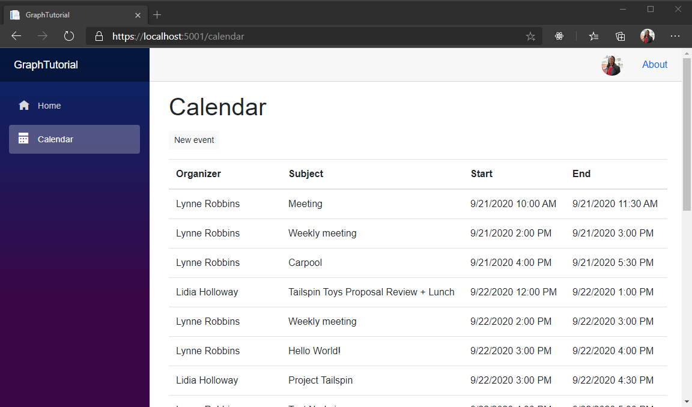

<!-- markdownlint-disable MD002 MD041 -->

このセクションでは、Microsoft Graph をアプリケーションに追加して、現在の週のユーザーの予定表のビューを取得します。

## <a name="get-a-calendar-view"></a>予定表ビューを取得する

1. **Calendar** という名前 **のディレクトリに** 新しいファイルを作成し、次のコードを追加します。

    ```razor
    @page "/calendar"
    @using Microsoft.Graph
    @using TimeZoneConverter

    @inject GraphTutorial.Graph.GraphClientFactory clientFactory

    <AuthorizeView>
        <Authorized>
            <!-- Temporary JSON dump of events -->
            <code>@graphClient.HttpProvider.Serializer.SerializeObject(events)</code>
        </Authorized>
        <NotAuthorized>
            <RedirectToLogin />
        </NotAuthorized>
    </AuthorizeView>

    @code{
        [CascadingParameter]
        private Task<AuthenticationState> authenticationStateTask { get; set; }

        private GraphServiceClient graphClient;
        private IList<Event> events = new List<Event>();
        private string dateTimeFormat;
    }
    ```

1. 次のコードをセクション内に追加し `@code{}` ます。

    :::code language="csharp" source="../demo/GraphTutorial/Pages/Calendar.razor" id="GetEventsSnippet":::

    このコードの内容を検討してください。

    - ユーザーに追加されたカスタムクレームから、現在のユーザーのタイムゾーン、日付の形式、および時刻の形式を取得します。
    - ユーザーが優先するタイムゾーンで、現在の週の開始と終了を計算します。
    - 現在の週の Microsoft Graph から予定表ビューを取得します。
        - このヘッダーには、 `Prefer: outlook.timezone` Microsoft Graph が `start` 指定されたタイムゾーンのプロパティとプロパティを返すためのヘッダーが含まれてい `end` ます。
        - を使用して `Top(50)` 、応答で50イベントを要求します。
        - を使用して、 `Select(u => new {})` アプリによって使用されるプロパティのみを要求します。
        - を使用して `OrderBy("start/dateTime")` 、結果を開始時刻で並べ替えます。

1. 変更内容をすべて保存し、アプリを再起動します。 [ **予定表** ] ナビゲーション項目を選択します。 アプリには、Microsoft Graph から返されたイベントの JSON 表現が表示されます。

## <a name="display-the-results"></a>結果の表示

これで、JSON ダンプをよりユーザーフレンドリなものに置き換えることができます。

1. 次の関数をセクション内に追加し `@code{}` ます。

    :::code language="csharp" source="../demo/GraphTutorial/Pages/Calendar.razor" id="FormatDateSnippet":::

    このコードは ISO 8601 の日付文字列を取得し、それをユーザーの優先する日付と時刻の形式に変換します。

1. `<code>`要素内の要素を `<Authorized>` 次のように置き換えます。

    :::code language="razor" source="../demo/GraphTutorial/Pages/Calendar.razor" id="CalendarViewSnippet":::

    これにより、Microsoft Graph によって返されるイベントのテーブルが作成されます。

1. 変更内容を保存し、アプリを再起動します。 これで、 **予定表** ページがイベントのテーブルをレンダリングするようになります。

    
