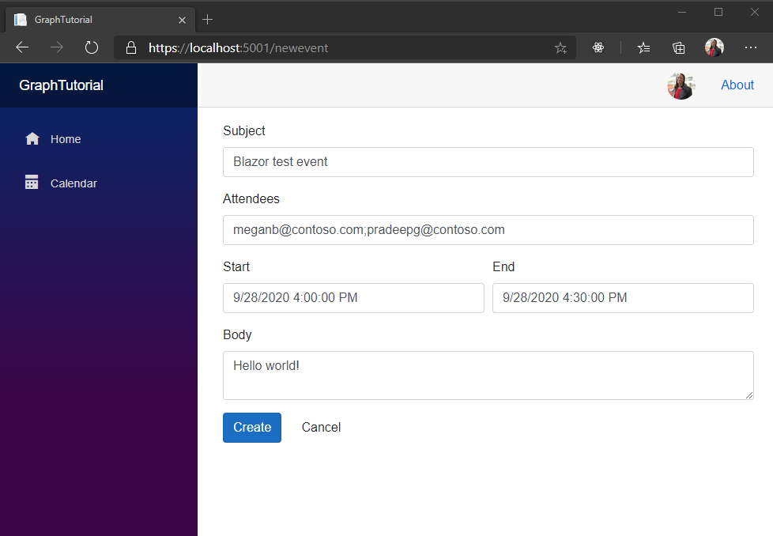

<!-- markdownlint-disable MD002 MD041 -->

このセクションでは、ユーザーの予定表にイベントを作成する機能を追加します。

1. **Newevent** という名前 **のディレクトリに** 新しいファイルを作成し、次のコードを追加します。

    :::code language="razor" source="../demo/GraphTutorial/Pages/NewEvent.razor" id="NewEventFormSnippet":::

    これにより、ユーザーが新しいイベントの値を入力できるように、ページにフォームが追加されます。

1. ファイルの末尾に次のコードを追加します。

    :::code language="razor" source="../demo/GraphTutorial/Pages/NewEvent.razor" id="NewEventCodeSnippet":::

    このコードの内容を検討してください。

    - これにより `OnInitializedAsync` 、認証されたユーザーのタイムゾーンを取得します。
    - では、 `CreateEvent` フォームからの値を使用して、新しい **Event** オブジェクトを初期化します。
    - Graph SDK を使用して、ユーザーの予定表にイベントを追加します。

1. 変更内容をすべて保存し、アプリを再起動します。 [ **カレンダー** ] ページで、[ **New event**] を選択します。 フォームに入力し、[ **作成**] を選択します。

    
